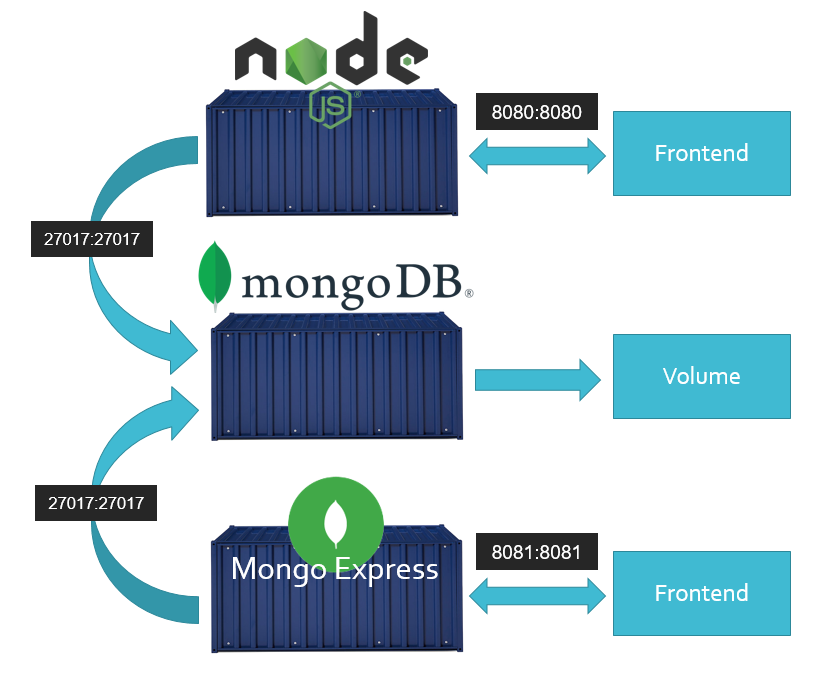
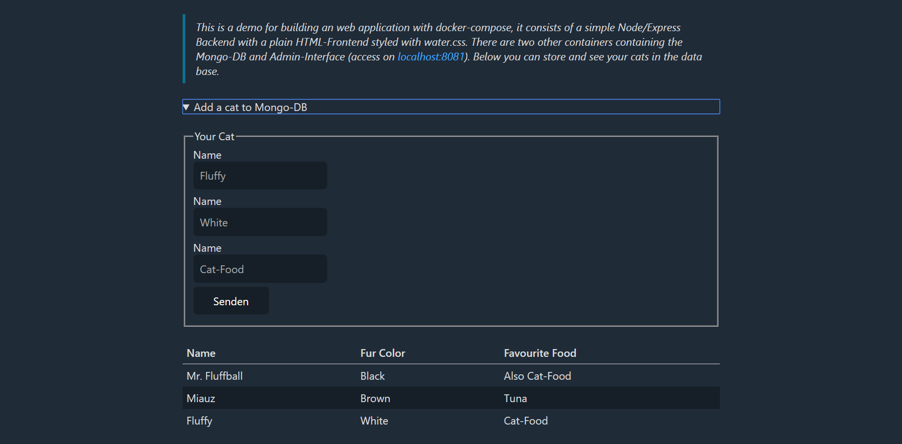

# Cat-DB (A demo for docker-compose)

This is a demo for building a web application with docker-compose, 
it consists of a simple Node/Express backend with a plain HTML-Frontend
styled with [water.css]([https://kognise.github.io/water.css/]). There are 
two other containers containing Mongo-DB and admin interface for Mongo.
This application allows you to store and view cute kittens in a database.

# Run the application

1. Download and install [DockerDesktop](https://hub.docker.com/?overlay=onboarding)
2. Open up a terminal in the projects path
3. Create a persistent volume for Mongo: `docker volume create --name=cat-mongo-data` 
4. Start the docker containers: `docker-compose up`
5. Open the web interface with https://localhost:8080
6. You can access the Mongo admin interface with https://localhost:8081

# About the containers

The project contains three containers structured by docker-compose:
- A **Mongo DB** container
- A **Mongo Express** container
- A **Cat-App** container based on the **node** image

The Cat-App and Mongo Express accesses the Mongo DB over its exposed address `mongodb://mongo-db:27017`.
While Mongo DB persists the data in a volume.

# Screenshots

